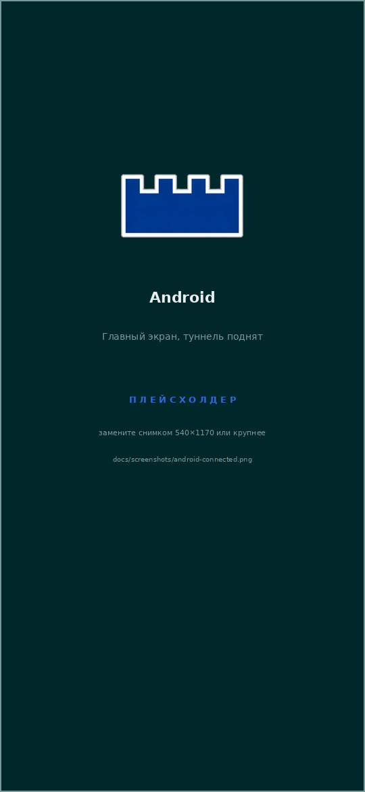
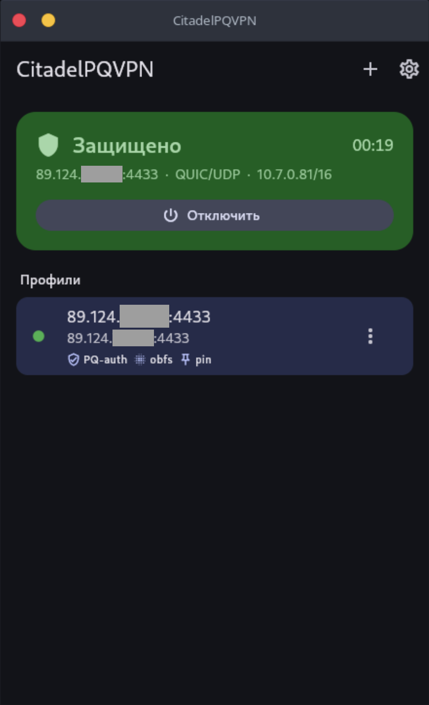
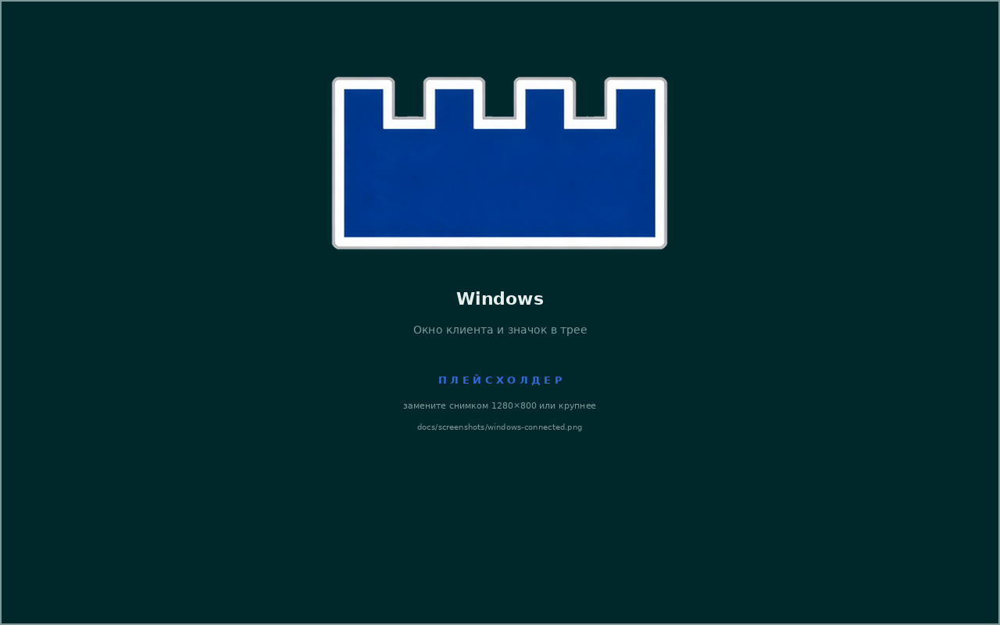
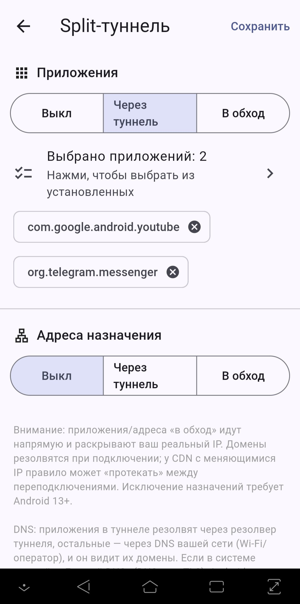
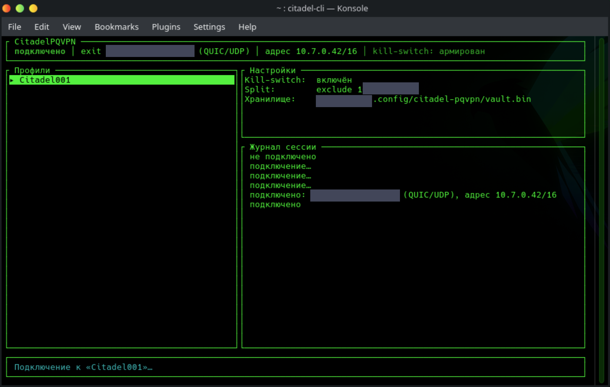

<div align="center">


# CitadelPQVPN

**Постквантовый VPN для людей, а не для лаборатории.**
Гибридный обмен ключами `X25519 + ML-KEM-768` поверх QUIC/MASQUE, обфускация трафика под
анти-DPI, анонимная аутентификация без учётных записей — и обычные клиенты под Android,
Linux и Windows.

[](https://github.com/QuantumAES/CitadelPQVPN/actions/workflows/ci.yml)
[](https://github.com/QuantumAES/CitadelPQVPN/actions/workflows/windows.yml)
[](https://github.com/QuantumAES/CitadelPQVPN/releases/latest)
[](LICENSE)

</div>

> ### ⚠️ Публичная бета
>
> Это **первый публичный релиз**. Криптография собрана из проверенных библиотек (rustls/aws-lc-rs,
> quinn, BLAKE3), протокол и клиенты покрыты тестами и четырьмя внутренними security-ревью — но
> **независимого внешнего аудита не было**. Если от вашей приватности зависит свобода или
> безопасность, не полагайтесь на этот проект как на единственную меру защиты.
>
> Известные ограничения релиза перечислены ниже, в разделе «[Чего пока нет](#чего-пока-нет)».

## Как это выглядит

| Android | Linux | Windows |
|:---:|:---:|:---:|
|  |  |  |
| Туннель поднят | Графический клиент | Клиент и служба |

| Раздельный туннель (Android) | Консольный клиент (Linux) |
|:---:|:---:|
|  |  |

## Зачем это нужно

**Постквантовая защита сегодня, а не после появления квантового компьютера.** Трафик,
записанный сейчас, расшифровывают позже — атака «harvest now, decrypt later». Ключи сессии
согласуются гибридно (`X25519MLKEM768`): чтобы вскрыть запись, нужно сломать *обе* схемы,
классическую и постквантовую. Подлинность сервера подтверждается парой Ed25519 + **ML-DSA-65**
(FIPS 204), поэтому и подмена сервера не становится проще с приходом CRQC.

**Соединение не выглядит как VPN.** Первый уровень — обфускация под общим PSK: на проводе
псевдослучайный поток без опознаваемых заголовков, со случайным паддингом и защитой от
активного зондирования (на пробу без ключа сервер просто молчит). Если UDP заблокирован,
клиент сам уходит на TCP/443.

**Сервер не знает, кто вы.** Доступ подтверждается анонимным токеном (**VOPRF над ristretto255,
Privacy Pass / RFC 9497**; до 2026-08 это была слепая подпись RSA по RFC 9474): издатель выдаёт
токен вслепую, а exit проверяет его, не зная, кому он выдан, — и токен привязан к сессии, то есть
перехваченный не работает у другого предъявителя.
Учётных записей, почты и телефона нет. Exit и издатель по умолчанию **не ведут журналов**
с адресами, идентификаторами и назначениями.

**Свой сервер, а не чужой сервис.** Exit разворачивается одной командой на любом VPS;
подписанные бинари, проверка подписи установщиком. Никакой инфраструктуры проекта в схеме нет.

### Что умеют клиенты

- **Kill-switch** — при обрыве туннеля трафик блокируется, а не утекает мимо: iptables на
  Linux, WFP на Windows. На Android ту же роль выполняет штатный переключатель ОС
  «Постоянная VPN» → «Блокировать соединения без VPN».
- **Раздельное туннелирование** — по приложениям (Android) и по назначениям/подсетям
  (Android, Linux, Windows).
- **Защита от утечки DNS** — резолвинг только через туннель, при желании DoH.
- **Профили и хранилище** — несколько exit'ов, переключение и failover; секреты лежат в
  зашифрованном хранилище (Argon2id + AES-256-GCM), мастер-пароль задаёте вы. На Android
  хранилище можно открывать **отпечатком**: ключ заворачивается неэкспортируемым ключом Android
  Keystore, который требует биометрии на каждую операцию. По умолчанию выключено — палец
  прикладывают под принуждением, пароль остаётся в голове. **Автозамок** закрывает хранилище
  после простоя и при уходе в фон (по умолчанию 5 минут; выключить можно) — активный туннель он
  не трогает, только убирает секреты с глаз и из памяти.
- **Честность о захвате IPv6 (Android)** — туннель IPv4-only, весь IPv6 заворачивается в него;
  если устройство этого не позволяет, приложение говорит об этом прямо на главном экране, а не
  показывает «Защищено». Настройкой «Строгий IPv6» можно запретить подключение без захвата.
- **Маскировка таймингов** — три профиля с честно названной ценой в трафике; выключена по
  умолчанию, в простое не тратит ни батарею, ни канал.
- **Подключение по ссылке или QR** — `citadel://…`; полные ключи не передаются, ссылка несёт
  лишь обязательства `H(pub)`, клиент дотягивает и сверяет их сам.
- **Реконнект при смене сети** — Wi-Fi ↔ LTE и NAT-rebind переживаются миграцией соединения
  QUIC, без перезапуска туннеля.
- **Запрет снимков экрана** на Android (включён по умолчанию).

## Установка

Все артефакты — на странице [релизов](https://github.com/QuantumAES/CitadelPQVPN/releases/latest).
Перед установкой стоит [проверить подпись](#проверка-подлинности): она для того и существует.

**Android** — `CitadelPQVPN-<версия>.apk`, установка из файла (потребуется разрешить установку
из неизвестных источников). Google Play не используется.

**Linux, графический клиент:**

```bash
tar --zstd -xf citadel-desktop-linux-x86_64.tar.zst
cd citadel-desktop-linux-* && ./install.sh          # спросит sudo
sudo usermod -aG citadel-vpn "$USER"                # затем ПЕРЕЛОГИНЬТЕСЬ
/opt/citadel-pqvpn/app
```

**Linux, консольный клиент** (демон + TUI, с разделением привилегий):

```bash
tar --zstd -xf citadel-cli-linux-x86_64.tar.zst
cd citadel-cli-linux-* && sudo ./install.sh
sudo usermod -aG citadel-vpn "$USER"                # затем ПЕРЕЛОГИНЬТЕСЬ
citadel-cli
```

Право поднимать туннель даёт членство в группе `citadel-vpn`, и установщик никого туда не
добавляет сам: её участник управляет маршрутизацией всей машины. Без членства клиент скажет
«нет доступа к сокету» — это не поломка, а именно это правило.

**Windows 10/11 (x64)** — `CitadelPQVPN-Setup-<версия>.exe`, запуск от администратора.
Ставит приложение, драйвер WinTUN и системную службу `citadel-svc`, которая держит адаптер,
маршруты и фильтры kill-switch. Установщик не подписан Authenticode, поэтому SmartScreen
покажет «Неизвестный издатель»: «Подробнее» → «Выполнить в любом случае». Подлинность
проверяется по `sha256sums` и подписи minisign — ими и стоит пользоваться.

### Проверка подлинности

Хеши всех артефактов релиза лежат в `sha256sums`, а сам файл подписан релизным ключом проекта:

```bash
minisign -V -P RWSErwVVdH0bhg9dQViFezkqCQPfWpZt18rK0irjOOpNfUW3G4hkoNp4 -m sha256sums
sha256sum -c sha256sums --ignore-missing
```

Тот же публичный ключ — в [`packaging/release/citadel-release.pub`](packaging/release/citadel-release.pub)
и вшит в серверный установщик.

## Свой exit-сервер

Нужен любой VPS с публичным адресом (Debian/Ubuntu, root). Версия указывается явно —
установщик намеренно не умеет «latest»: подставлять в привилегированную установку то, что
сегодня оказалось свежим релизом, — плохая идея.

```bash
curl -fsSLO https://github.com/QuantumAES/CitadelPQVPN/releases/download/v0.8.0/install-citadel-server.sh
CITADEL_VERSION=v0.8.0 bash install-citadel-server.sh
```

Установщик проверяет подпись бинарей вшитым ключом, поднимает exit и издателя токенов,
генерирует ключевой материал **на сервере** (секреты не покидают машину) и печатает
`citadel://`-ссылку — её и открывают клиентом. Дальше абоненты добавляются и отзываются
по защищённому каналу *внутри самого туннеля*: административный порт снаружи закрыт.

Порты первая установка выбирает **случайно** (10000–31999) и запоминает в `$DIR/etc/ports.env`:
фиксированные 4433/udp и 7000/tcp были узнаваемой подписью Citadel на сканах. Обновление уже
стоящего сервера порты не меняет (иначе абоненты остались бы со старой ссылкой и закрытым портом).
Задать свои — явными флагами:

```bash
bash install-citadel-server.sh v0.8.0 --udp-port 5443 --issuer-port 7300   # см. --help
```

Клиент берёт порты из ссылки, настраивать на устройствах ничего не нужно.

Подробности и модель угроз — [`docs/SPEC.md`](docs/SPEC.md),
[`docs/THREAT-MODEL-STRIDE.md`](docs/THREAT-MODEL-STRIDE.md).

## Как устроено

```
L4 управление  токены и выдача, выбор exit, назначение адреса (capsules)
L3 данные      CONNECT-IP: IP-пакеты как QUIC DATAGRAM        ── citadel-masque, citadel-tun
L2 сессия      PQ-QUIC + TLS 1.3 (X25519MLKEM768), pin, ML-DSA ── citadel-quic
L1 обфускация  ChaCha20-Poly1305 PSK-wrap, паддинг, пейсинг    ── citadel-obfs
L0 транспорт   UDP (основной) / TCP:443 (обход блокировки)
```

| Крейт | Назначение |
|---|---|
| `citadel-obfs` | обфускация L1: PSK-gated AEAD, паддинг, анти-реплей, байт-точные тест-векторы |
| `citadel-masque` | плоскость данных CONNECT-IP: varint, датаграммы, капсулы, IPv4/ICMP/UDP/DNS |
| `citadel-tun` | TUN-устройство (Linux) |
| `citadel-token` | анонимные токены (VOPRF/ristretto255): роли клиента, издателя и admin-канал |
| `citadel-quic` | PQ-QUIC, obfs-сокет, rate-limit, TCP-fallback, миграция, PQ-аутентификация |
| `citadel-client` | движок как встраиваемая библиотека + хранилище профилей и креды |
| `citadel-helper` | привилегированный помощник Linux-GUI (polkit): TUN и маршруты, fd по SCM_RIGHTS |
| `citadel-vpnd` / `citadel-engine` / `citadel-cli` | консольный клиент: демон под root, движок без привилегий, TUI |
| `citadel-winnet` / `citadel-winsvc` | Windows: сеть, WFP, WinTUN и служба-плумбер |

Клиентское приложение — Flutter поверх этого движка через `flutter_rust_bridge`
([`docs/CLIENT-ARCH.md`](docs/CLIENT-ARCH.md), консольный — [`docs/LINUX-CLI.md`](docs/LINUX-CLI.md)).

## Сборка и тесты

Требуется rustup **stable 1.96+** (системный `cargo` 1.85 не соберёт зависимости),
`cmake` и `clang` для `aws-lc-rs`, Flutter 3.44+ для приложения. Полная настройка окружения —
`tools/setup-dev-env.sh`, подробности — [`docs/BUILD-INSTALL.md`](docs/BUILD-INSTALL.md).

```bash
cargo test --workspace                     # юнит-тесты движка (200+)
cargo clippy --workspace --all-targets -- -D warnings

bash docker/run-demo.sh                    # e2e: настоящий туннель в контейнерах
bash docker/run-cli-tests.sh               # e2e: консольный клиент, привилегии, kill-switch
```

Оба харнеса поднимают стенд (издатель + два exit'а + клиент), прогоняют сценарии — ping и HTTP
через туннель, egress-фильтр, устойчивость к зондированию, сброс привилегий, утечки DNS,
rate-limit, миграцию, TCP-fallback, failover, слепую выдачу токенов, одноразовость первичной
ссылки, недостижимость инфраструктуры из туннеля, PQ-аутентификацию с
негативными проверками, административный канал — и **сами гасят стенд**, что бы ни случилось.
Провал сценария означает ненулевой код возврата: те же команды выполняет CI.

## Документация

| Документ | О чём |
|---|---|
| [`docs/SPEC.md`](docs/SPEC.md) | протокол целиком: слои, капсулы, форматы, обоснования решений |
| [`docs/THREAT-MODEL-STRIDE.md`](docs/THREAT-MODEL-STRIDE.md) | модель угроз и сопоставление находок с кодом |
| [`docs/SECURITY-ROADMAP.md`](docs/SECURITY-ROADMAP.md) | security-трек и журнал внутренних ревью |
| [`docs/PHASE0-OBFS.md`](docs/PHASE0-OBFS.md) | обфускация L1: формат, паддинг, анти-зондирование |
| [`docs/CLIENT-ARCH.md`](docs/CLIENT-ARCH.md) | устройство клиентов (Android, Linux GUI, Windows) |
| [`docs/LINUX-CLI.md`](docs/LINUX-CLI.md) | консольный клиент и его модель привилегий |
| [`docs/BUILD-INSTALL.md`](docs/BUILD-INSTALL.md) | сборка, окружение, подпись APK |
| [`docs/RELEASE.md`](docs/RELEASE.md) | CI/CD, раннеры, секреты, выпуск релиза |
| [`docs/BENCHMARKS.md`](docs/BENCHMARKS.md) | замеры криптографии и обфускации |
| [`docs/SECURITY-AUDIT-4-2026-08.md`](docs/SECURITY-AUDIT-4-2026-08.md) | последний внутренний аудит: находки, заходы исправлений, открытый бэклог (§20) |
| [`docs/CWE-REVIEW-PLAN-2026-08.md`](docs/CWE-REVIEW-PLAN-2026-08.md) | программа системной проверки по CWE и проактивные меры |
| [`docs/COVER-TRAFFIC-BATTERY-2026-08.md`](docs/COVER-TRAFFIC-BATTERY-2026-08.md) | маскировка трафика: цена в батарее и что с ней сделано |

## Чего пока нет

- **Внешнего аудита безопасности.** Внутренних ревью было четыре (последнее —
  `docs/SECURITY-AUDIT-4-2026-08.md`, плюс пост-аудитные заходы до 2026-08-14), внешнего — ни одного.
- **Клиентов под iOS/iPadOS и macOS.** Архитектура выбрана (Apple Network Extension), работа
  не начата: сборка требует macOS и Xcode.
- **Подписи Authenticode** у Windows-установщика и публикации в Google Play.
- **Только x86-64** в готовых сборках десктопа и сервера; ARM собирается из исходников.
- Скорость не оптимизировалась: приоритетом были корректность и приватность.

## Безопасность

Нашли проблему — пожалуйста, не открывайте публичный issue. Используйте
[приватный отчёт GitHub](https://github.com/QuantumAES/CitadelPQVPN/security/advisories/new).

Секретов в репозитории нет и быть не должно: PSK, ключи издателя и exit'а, pin сертификата
генерируются в рантайме на сервере. Релизный minisign-ключ хранится вне репозитория и вне
GitHub — подписывает сборочная машина.

## Лицензия

[Apache-2.0](LICENSE).
